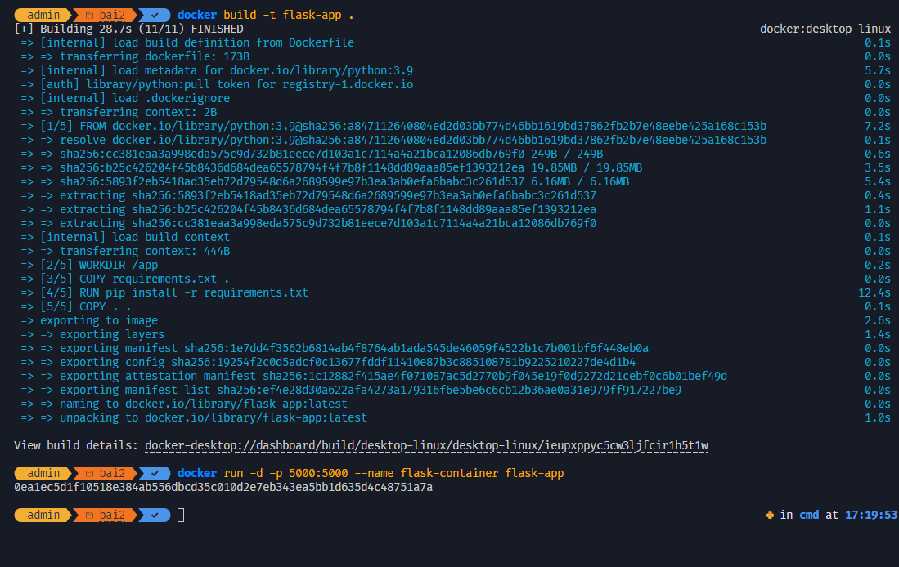

# Bài Tập Docker

## Thông tin
- Môn học: Kiến trúc và Thiết kế phần mềm
- Lớp: [DHKTPM17CTT]
- Sinh viên: [Trần Chí Bảo]
- MSSV: [21080741]

## Nội dung bài tập
Bài tập gồm 2 phần chính:

### Phần 1: Các lệnh cơ bản thao tác với Docker
Tổng hợp các lệnh Docker cơ bản và kết quả thực thi:

```bash
# 1. Kiểm tra phiên bản Docker
docker --version

# 2. Chạy container hello-world
docker run hello-world

# 3. Tải image nginx
docker pull nginx

# 4. Liệt kê các images
docker images

# 5. Chạy nginx container
docker run -d nginx

# ... các lệnh khác
```

## Minh chứng thực hiện

### Phần 1: Các lệnh Docker cơ bản


### Phần 2: Thực hành với Dockerfile

#### Bài 1: Node.js Application


#### Bài 2: Python Flask Application


#### Bài 3: React Application


#### Bài 4: Static Website với Nginx


#### Bài 5: Go Application


#### Bài 6: Multi-stage Build


#### Bài 7: Environment Variables


#### Bài 8: PostgreSQL


#### Bài 9: Redis


#### Bài 10: PHP với Apache


#### Docker PS Command
